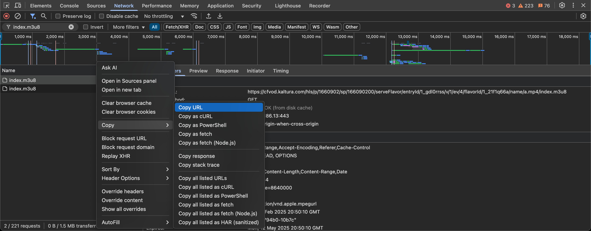

# KalScribe - Kaltura Video Downloader/Transcriber

## 🎓 What is KalScribe?

KalScribe is a specialized tool designed to help students and educators download videos from Kaltura-based academic platforms and automatically generate high-quality transcriptions. Perfect for note-taking, studying offline, and making educational content more accessible.

## ✨ Features

- **Video Download**: Capture Kaltura videos in MP4 format
- **Automatic Transcription**: Convert speech to text using Deepgram's Nova-2 AI model
- **User-Friendly Interface**: Simple terminal-based interface with progress tracking
- **Flexible Usage**: Run directly via command line or through a local web server
- **Custom Organization**: Name and organize your downloads in personalized folders

## 🤔 Why Use KalScribe?

- **Study More Efficiently**: Search for specific content in transcripts rather than watching entire videos
- **Accessibility**: Create text versions of video lectures for better accessibility
- **Offline Access**: Download lectures to watch when internet access is limited
- **Reference Tool**: Easily quote or cite specific sections of lectures
- **Time-Saving**: Read transcripts at your own pace instead of watching full videos

## 🚀 Installation

### Prerequisites
- [Node.js](https://nodejs.org/) (v14 or higher)
- [npm](https://www.npmjs.com/) (comes with Node.js)

### Setup

1. Clone this repository:
   ```bash
   git clone https://github.com/yourusername/kaltura-downloader.git
   cd kaltura-downloader
   ```

2. Install dependencies:
   ```bash
   npm install
   ```

## 📝 How to Use KalScribe

KalScribe offers two methods for downloading and transcribing videos:

### Method 1: Web Server Interface (Recommended)

1. **Start the server**:
   ```bash
   node server.js
   ```

2. **Find your video URL**:
   - Open the Kaltura video you want to download in your browser
   - Right-click and select "Inspect" or press F12
   - Go to the "Network" tab
   - Start playing the video
   - Type `index.m3u8` in the filter search box
   - Right-click on the result and select "Copy" > "Copy Request URL"

3. **Send request to KalScribe**:
   - Open your browser and navigate to:
   ```
   http://localhost:3333/url?url=YOUR_COPIED_URL
   ```
   - Replace `YOUR_COPIED_URL` with the URL you copied

4. **Name your download**:
   - In the terminal where the server is running, you'll be prompted to enter a folder name
   - Type a name for your download folder and press Enter

5. **Wait for processing**:
   - KalScribe will download the video and create a transcript
   - Progress will be displayed in the terminal
   - Files will be saved to `output/[your-folder-name]/`

### Method 2: Direct Command Line

For advanced users who prefer direct command line usage:

```bash
node kalturatranscriber.cjs "YOUR_COPIED_URL" "output-folder-name"
```

Replace:
- `YOUR_COPIED_URL` with the Kaltura video URL
- `output-folder-name` with your desired folder name

## 🔍 Finding the Video URL (Step-by-Step)

1. Open your Kaltura video in a browser
2. Press **F12** to open Developer Tools
3. Click on the **Network** tab
4. Start playing the video
5. Type **index.m3u8** in the filter box at the top
6. Right-click on the filtered result
7. Select **Copy** > **Copy Request URL**



## 📂 Output Files

KalScribe creates the following files in your specified output folder:

- `video.mp4` - The downloaded video file
- `audio.wav` - The extracted audio (used for transcription)
- transcript.txt - The full text transcript of the video

## ⚠️ Important Notes

- This tool is intended for **personal educational use only**
- Please respect copyright laws and your institution's terms of service
- The Deepgram API key included has usage limitations

## 🤝 Contributing

Contributions are welcome! Feel free to submit issues or pull requests.

## 📄 License

© Sooraj Gupta 2024

---